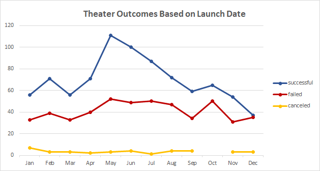

# Kickstarting with Excel

## Overview of Project

### Purpose
* Purpose of the analysis is to find the best possible combination of Theater Launch Date and Play's fundraising goal for Louise's play *Fever*. By performing the analysis from the data provided, it is apparent from the graphs that the best combination of Theater Launch Date and Fundraising Goal would be between the months of May and July with a fundraising goal of less than 5000. 

## Analysis and Challenges

### Analysis of Outcomes Based on Launch Date
* The Analysis of The Launch Date was performed by creating a pivot table with *Outcomes* in Columns, *Date Created Conversion* as Rows, and *Parent Category & Years* as the Filters. The Table filtered out the data to show only Theater as the category, and the following graph can be generated from the data. 

* As a conclusion, the months of May, June, and July are the best months as theater launch dates, with May being the month with the most successful Launch Dates. Thus, from this analysis, it is recommended that Louise should launch the play during the three summer months. 

### Analysis of Outcomes Based on Goals
* The Analysis of Outcomes was performed by gathering data from three criterias, *Goal*, *Outcome* (Successful,Failed,or Canceled), and *Play* as the category. The following graph was plotted from the findings. 

* From this graph, it can be concluded that a fundraising Goal of less than 5000 would have the highest Successful Percentage. Though a Goal of 35000 to 45000 also shows a similar percentage of success and fails as less than 5000, but the Total Projects recorded between 35000 to 45000 fundraising goal is only 9, compared to 720 Total Projects recorded for less than 5000. With such a small sample size, the data should not be used as a reliable source of comparison. 

### Challenges and Difficulties Encountered

* There wasn't any significant challenges or difficulties encountered during this analysis project, as the data set was straight forward and was able to lead to a clear conclusion. I believe a conclusion would be more difficult to establish if the data set had a more random outcomes. For instance, the Categories *Publishing* and *Technology* suffers from a more random cluster of data that is difficult to conclude which month would be the best for a Launch Date. 
* Another challenge would be the possibilies of a better outcome with a higher fundraising goal. Our conclusion of *less than 5000* was established from a data set that has a significant more *Total Project* number than the rest of the data. It is completely possible that a higher fundraising goal could also yield to a equally efficient or better successful outcome. However, it is impossible for tell with the given data due to the lack of Projects with high fundraising goals.  

## Results

- What are two conclusions you can draw about the Outcomes based on Launch Date?
** May to July are the best months as Launch Dates.
** Winter times are some of the worst months to launch the play.

- What can you conclude about the Outcomes based on Goals?
** Data is very reliable with fundraising goals less than 15000 for its number of Total Projects. Data for higher Fundraising Goals becomes less reliable as the total number of projects decreases significantly. 
** Fundraising goal of less than 5000 shows confident data with a successful percentage of +73%.

- What are some limitations of this dataset?
** The type of Plays is not presented in this dataset. It is very possible that one type of Play would be significantly more successful than another. 
** As previously mentioned, it is highly possible that a higher fundraising goal would be as equally or more successful as less than 5000 fundraising goal due to the lack of data. As the dataset becomes smaller, outliers would heavily skew the conclusion. 
** *Country* has not been filtered during this analysis, therefore the conclusion is based on a data gathered across multiple countries. Unless Louise's play will be shown at multiple countries listed in this dataset, the conclusion would become weaker if Louise only launches the play at fewer countries. 

- What are some other possible tables and/or graphs that we could create?
** We could create graphs based on individual countries.
** A Box and Whisker Chart could be presented to show outliers in fundraising goals. 
