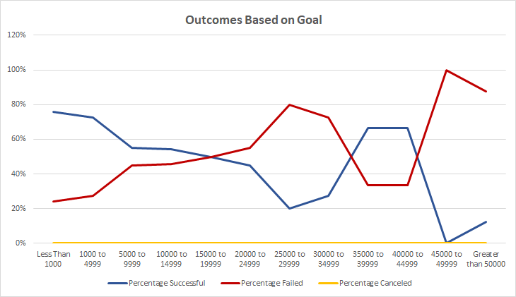

# Kickstarting with Excel

## Overview of Project

### Purpose
* Purpose of the analysis is to find the best possible combination of Theater Launch Date and Play's fundraising goal for Louise's play *Fever*. By performing the analysis from the data provided, it is apparent from the graphs that the best combination of Theater Launch Date and Fundraising Goal would be between the months of May and July with a fundraising goal of less than $5000. 

## Analysis and Challenges

### Analysis of Outcomes Based on Launch Date
* The Analysis of The Launch Date was performed by creating a pivot table with *Outcomes* in Columns, *Date Created Conversion* as Rows, and *Parent Category & Years* as the Filters. We need to filter out the data to show only theater as the category, and with the previous settings selected for the pivot table, 

### Analysis of Outcomes Based on Goals

### Challenges and Difficulties Encountered

## Results

- What are two conclusions you can draw about the Outcomes based on Launch Date?

- What can you conclude about the Outcomes based on Goals?

- What are some limitations of this dataset?

- What are some other possible tables and/or graphs that we could create?
